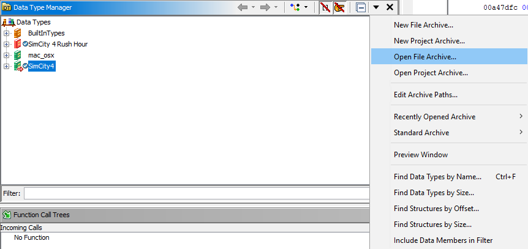

# sc4-ghidra-symbols

This repository contains symbol information for Ghidra extracted from the MacOS PowerPC port of SimCity 4.

# How to Use

## Loading the Archive

1. Download `SimCity4.gdt`.
2. Open the Data Type Manager.
3. Select ▼ > Open File Archive.

4. Browse for the downloaded archive and open it.

## Importing Types from the Archive

This procedure has to be done for each type that you wish to import. There may be an automated/bulk way of doing this, but I am not aware of one.

### Replacing Types

1. Right-click on one of the structures in the binary and select *Replace*.

2. Select the matching type in the `SimCity4` archive.

3. Click OK in the dialog.

### Type Conflicts

The conflicting types that are imported from the `SimCity4` archive will show up in the Data Type Manager with a `.conflict` extension.

#### Resolving Type Conflicts

1. Right-click on the structure that does not have the `.conflict` extension and select *Replace*.

2. Select the matching type in the `SimCity4` archive.

3. Click OK in the dialog.

## Adding Types to the Archive

Note that the `SimCity4` archive must be open for editing, by default it is opened in read-only mode.
To change this, right-click on the `SimCity4` archive and select *Open for Editing*.

1. Right-click on the type in the binary that you want to add to the archive and select *Associate With Archive*.
2. Select the `SimCity4` archive in the dialog that pops up.
3. Save the modified `SimCity4` archive.

## Synchronizing Types Between the Binary and Archive

### Committing Changes to the Archive

1. Right-click on the binary in the Data Type Manager and select the *Commit Data Types To* menu item.
2. Select the `SimCity4` archive in the menu.
3. If necessary, select the types you want to commit in the dialog.

### Updating the Binary Types from the Archive

1. Right-click on the binary in the Data Type Manager and select the *Update Data Types From* menu item.
2. Select the `SimCity4` archive in the menu.
3. If necessary, select the types you want to update in the dialog.
